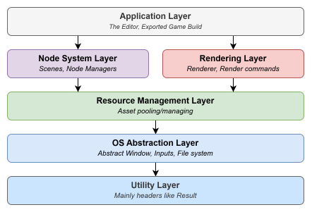

# Bird Engine
Bird Engine is a Specialized 2d game engine. 

## Features
### Nodes
- nodes are the basic building blocks of the engine, they can be used to create anything from a simple sprite to a complex game object
- prefabs, possibility to use them and override specific traits on them

### Embedded AngelScript
- possibility to use it as a script component

### Serialization / Deserialization
- saving and loading projects using json files
- possibility to export scenes into lvl files
- build in support for saving loading game states (in-game game save files)
- uses FlatBuffers

### Plugins
- 3rd party plugins
- specialized plugins for specific tasks, like datalog, physics

## Architecture
This engine uses relaxed layered architecture, meaning that the layers are not strictly separated, but the layers on top can communicate with every layer bellow it.

## Used libraries
- FlatBuffers
- AngelScript
- Dear ImGui
- nlohmann/json
- GLM
- Vulkan
- Metal
- GLFW

## Repository
this repository uses the conventional commits format: https://www.conventionalcommits.org/en/v1.0.0/  
main branch is the latest stable release.  
dev branch is the latest working development version.  
feat/ branches are implementations of new features.  
fix/ branches are bugfixes.  
docs/ branches are documentation.