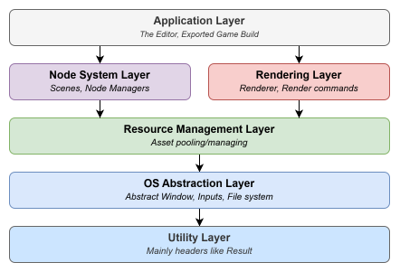

# About
Bird Engine is a specialized 2d game engine.   
**Project Status:** Early Development

# Goals
## Features of the editor for the end user
### Nodes
- nodes are the basic building blocks of the engine
- everything is a node approach
- a node is never a hybrid, it holds only a single responsibility: `Node2D`, `Sprite2D`, `ScriptNode`
- this system should encourage the "Call Down, Signal Up" approach
- `Node2D`'s transform works as an offset to its nearest parent's transform
### Embedded AngelScript
- possibility to use it as a script component
### Serialization / Deserialization
- saving and loading projects using json files
- possibility to export scenes into lvl files
- build in support for saving loading game states (in-game game save files)
- uses FlatBuffers
### Plugins
- 3rd party plugins
- specialized plugins for specific tasks, like datalog, physics

# Architecture
## Layers
This engine uses relaxed layered architecture, meaning that the layers are not strictly separated, but the layers on top can communicate with every layer bellow it.

## Systems
Each layer has it's own systems, like the `AssetManager` of the Resources layer. 
Each of the system's can request it's layers context, so the `AssetManager` would request 
`ResourcesContext` in its `AssetManager::create()` method as an argument, and pull out other system it needs.  
The tradeoff of this approach is that layer contexts have to be instantiated in the correct order 
and during initialization of some systems, other systems in the context might be null.

## RAII
The engine's api follows RAII principles. Prioritizing static factory methods (`::create()`), 
which call `::init()` and other initialization methods internally.

## No throwing
The engine's api is designed to never throw exceptions. Instead, it relies on the `Result<T>` utility class.

## Node System
### General idea
- The node system is a powerful tool for creating complex behaviors and interactions in the Bird Engine.
- It allows developers to work in OOP style, while using Data-Oriented Design (DOD) principles under the hood.
- The node system is built on top of ECS-like architecture.
### Architecture
- Every node is instance of the same class `Node`, which is essentially just a `NodeID` (see `node_type_definitions.hpp`) wrapper, that holds information about who is it's parent and children.
- The `Scene` defines, what managers will be used to manage the nodes.
- The managers are responsible for the actual node behavior.
- `Scene` is created using `SceneFactory::create_scene(std::string scene_type_name)`, scene types can be loaded using `SceneFactory::load_scene_definitions_from(std::string path)`.
- `Scene` also holds node_type_definitions you can create using the factory method listed bellow.
### Managers
- Every manager inherits from the `INodeManager` interface.
- Managers keep NodeIDs and hold their own information about the nodes.
- They use preferably contiguous memory to store the data, and use the NodeID as an index to access the data.
### Nodes
- Nodes are instantiated using the factory method  `Scene::create_node(NodeID parent_id, std::string node_type)`
- By instantiation we mean creating `NodeID` and calling `IManager::on_node_created(NodeID node_id)` on the associated managers.
- Node types can be loaded into `SceneFactory` using `SceneFactory::load_node_definitions_from(std::string path)`

## Rendering
There's an abstract `IRenderer` class, which has different implementation, for now mainly Vulkan.
### What should the renderer be able to do?
- **Targets & Passes:** Render to custom Framebuffers to support multiple viewports (Window, ImGui panels, off-screen textures) and a Post-Processing pipeline.
- **Primitives:** High-quality batched rendering of Sprites, Text (MSDF/SDF), and primitives (Rectangles, Circles, Polygons, Lines).
- **Camera & Culling:** Support World-Space and Screen-Space rendering via View/Projection matrices, with automated AABB frustum culling for off-screen objects.
- **Sorting & Batching:** Automatically sort drawables by Z-Index/Y-Position, and dynamically batch draw calls by Material/Texture to minimize state changes.
- **Material System:** Accept flexible Materials supporting custom shaders, textures, and normal maps, utilizing SSBOs for highly efficient per-object data overrides.
- **Lighting Environment:** Support 2D lighting (Directional, Point), normal-mapped specular highlights, and 2D shadow casting.
### Renderer frame lifecycle
- `Renderer::BeginFrame(target_texture)` - Begins frame with a target texture to draw onto
- `Renderer::BeginPass()` - Begin Render pass
- `Renderer::Submit(RenderCommand)` - Submits a render command to be rendered
- `Renderer::EndPass()` - End Render pass, creates a new clear Command Queue
- `Renderer::EndFrame()` - Ends the frame, draws onto the target texture

# Used libraries
- FlatBuffers
- AngelScript
- Dear ImGui
- nlohmann/json
- GLM
- Vulkan
- Metal
- GLFW
- doctest
- SPIRV-Cross
- stb_image
- glslang

# About the Repository
this repository uses the conventional commits format: https://www.conventionalcommits.org/en/v1.0.0/  
main branch is the latest stable release.  
dev branch is the latest working development version.  
feat/ branches are implementations of new features.  
fix/ branches are bugfixes.  
docs/ branches are documentation.